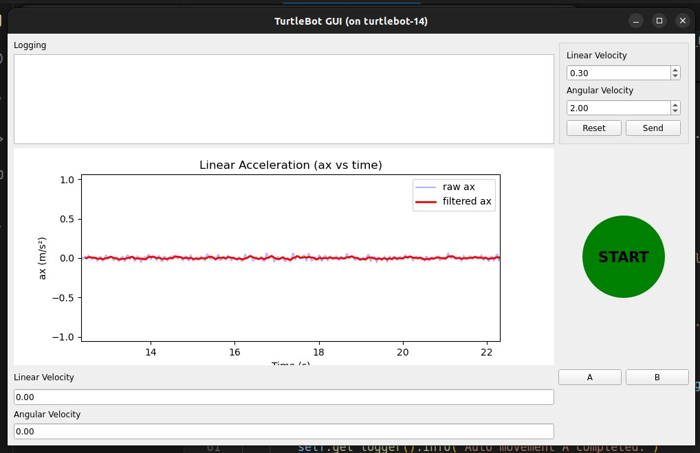

## I. Introduction
### Project name: Automatic Delivery Turtlebot Systems
#### i. Team number
* Team 12
#### ii. Team members 
* Sandy Lin
* Alan Cheng
* Yibo Yuan
#### iii. Academic Year
* 2025 Spring
#### iv. University
* Arizona State University
#### v. Class
* RAS598 Experimentation and Deployment of Robotic Systems
#### vi. Instructor
* Daniel M. Aukes

## II. Project
### i. Project description
#### Concept:
Our project combines a UR5 robotic arm with a Turtlebot to create an automated delivery robot system. We will set up two workstations (A, B) and two different colors of blocks (Red, Blue). The UR5 robotic arm will transfer the colored blocks onto the Turtlebot, and after the Turtlebot reads the colors, it will deliver the block to the designated workstation.
#### The research question this project seeks to answer is: 
To present the integration of a UR5 robotic arm and a Turtlebot, and optimize the process of sorting and delivering different colors of blocks to designated workstations.

### ii. Sensor Integration
The LiDAR will be used to collect a 3D point cloud and convert it into a map. During testing, we ensure that the LiDAR accurately senses the environment with real-time data to generate the complete map. The IMU is evaluated to confirm that it precisely measures movement and maintains stability, which is crucial for the robot's mobility. Additionally, the camera’s ability to recognize colors under various conditions will be tested. In the final demonstration, the LiDAR will be fully integrated to enable smooth navigation, ensuring that the Turtlebot moves efficiently towards workstations with the ability to avoid obstacles without collision. The IMU will be used to maintain the Turtlebot's balance and ensure stable movement during delivery tasks.

### iii. Interaction
#### RViz Interface:
We will use RViz to visualize the turtlebot states, LiDAR data, environment map, tf frames, navigation goals (two workstations), the planned path generated by Nav2, and debugging in real-time.

### iv. Control and Autonomy
The processed sensor data enables real-time responses such as collision avoidance, stability adjustments, and immediate path corrections. For instance, the LiDAR data helps detect obstacles, while the IMU provides vital motion and balance information. At the higher level, the controller uses the refined sensor data to update path planning, ensuring the Turtlebot navigates efficiently and delivers blocks to the designated workstation based on color recognition.

### v. Preparation needs
To build the system, we need to understand how communication between UR5 and TurtleBot 4 works. Choosing the most suitable path-planning algorithm, such as Dijkstra, A*, or a more optimized alternative, is crucial for efficient TurtleBot 4 navigation and minimizing delivery time. Lastly, integrating useful Python packages like OpenCV for object detection will enhance the system's capabilities.

### vi. Final Demonstrartion
#### What resources will you need?
- The reference project on internet like similar projects in Github and any materials given by Prof. Aukes.
- UR5 robotic arm and turtlebot robot
- Sensor like IMU, LIDAR, encoders, etc.
- High-performance computer

#### Describe the classroom setup requirements. 
- UR5 robot arm
- A few small boxes
- Several boards make up the obstacle course. 
- Enough space for robotic operation

#### Conditions change in any environment. 
We will test under several different obstacle conditions to ensure that the robot are robust enough to handle variability.

#### Testing & Evaluation plan: 
We will conduct several tests to see if the robot works accurately. We will compare the sensor data and analog outputs to real-world conditions to ensure that our designed algorithms can accurately adapt to environmental changes.

### vii. Impact
This project will enhance our understanding of multi-robot communication by coordinating the UR5 robotic arm and TurtleBot 4. Building an Rviz simulation will help us simulate and test the system. Developing our own user interface will improve interaction and control. Lastly, exploring different path-planning algorithms will deepen our knowledge of autonomous navigation.

### viii. Advising
Dr. Aukes serves as our advisor for this project, providing technical guidance and hardware support. With his expertise in ROS2 development, robotic motion planning, and control systems, he plays a crucial role in helping us navigate the technical challenges of integrating the UR5 robotic arm and Turtlebot. Additionally, we plan to seek further technical guidance from other experts in the field to ensure the success of our project.

### iv. Project Progress & Future Tasks
#### Current Achievements:
1. UR5 Robotic Arm Control  
We successfully implemented control over the UR5 robotic arm, enabling it to perform pick-and-place tasks from point A to point B.

<iframe width="560" height="315"
        src="https://www.youtube.com/embed/wdnD8_uXcG0"
        title="UR5 Robotic Arm Demo" frameborder="0"
        allow="accelerometer; autoplay; clipboard-write; encrypted-media; gyroscope; picture-in-picture; web-share"
        allowfullscreen>
</iframe>

2. GUI Enhancement:
Added an "Origin" button based on the previously developed GUI. After initiating the system with the "Start" button, pressing "Origin" commands the Turtlebot to move to the designated position and wait to receive colored blocks.

#### GUI Interface

  

---

#### RQT Graph Visualization

  

3. Predefined Actions:
We successfully enabled the TurtleBot to execute predefined actions. When button A is pressed, it moves forward 3 meters and then turns left for 1 meter; when button B is pressed, it moves forward 3 meters and then turns right for 1 meter.

    <iframe width="560" height="315"
            src="https://www.youtube.com/embed/AvNOWas0qkQ"
            title="YouTube video demo" frameborder="0"
            allow="accelerometer; autoplay; clipboard-write; encrypted-media; gyroscope; picture-in-picture; web-share"
            allowfullscreen>
    </iframe>

4. Path Planning Algorithm Implementation:
Created an initial version of path planning within ttb_nav.py, incorporating obstacle detection and avoidance using ROS2's Nav2 framework.

#### Upcoming Tasks:
1. Continuous Task Flow Logic:
Develop a controller that enables continuous round-trip operations between the UR5, the color detection positions, and the drop-off block position.

2. Path Planning Optimization:
Optimize the current path planning logic with more advanced algorithms such as A* or Dijkstra to enhance navigation efficiency and stability.

3. RViz Integration:
Add RViz visualization to support real-time monitoring and build a digital twin for the delivery system.

4. System Integration and Validation

#### Code Breakdown
1. GUI:
   
    a) The [`gui.py`](https://github.com/RAS598-2025-S-Team12/RAS598-2025-S-Team12.github.io/blob/main/src/t12_prj/t12_prj/gui.py), defines a 
    TurtleBotGUI class that inherits from both rclpy.Node and QtWidgets.QMainWindow, integrating a PyQt5 interface with ROS2 communication.

    b) It creates publishers for `/turtlebot_state`, `/gui_cmd_vel`, and `/simple_goal`, and subscribers for `/default_vel`, `/c3_14/odom`, and 
    `/c3_14/imu`, handling state, velocity commands, odometry, and IMU data.

    c) The GUI layout comprises a read-only logging panel, a Matplotlib canvas plotting raw and FIR-filtered linear acceleration over time, and 
    text fields displaying current linear and angular velocities.

    d) Spin-box controls with Reset/Send buttons enable manual velocity entry, while large START/STOP and A/B/Origin buttons toggle operation 
    and dispatch predefined navigation goals, each action logged with a timestamp.

    e) Callback methods (odom_callback, imu_callback) update velocity displays and append IMU samples to a rolling buffer; update_plot applies 
    a moving-average filter to the latest N samples before redrawing the acceleration graph.
   
2. UR5 ROS2 Control Node:

    a) The ROS2 nodes, implemented in Python, include:
       move_to_position.py: sends trajectory commands to control robot motion.
       get_position.py: subscribes and monitors robot joint states and end-effector poses.

    b) Publishers and subscribers involved:
       Publishes JointTrajectory messages to `/scaled_joint_trajectory_controller/joint_trajectory`.
       Subscribes to `/joint_states for joint angles`.
       Subscribes to `/tcp_pose_broadcaster/pose` for end-effector position feedback.

    c) Motion strategy:
       Vertical pick-and-place movements utilize linear trajectory commands (moveL) for precision.
       Horizontal movements employ joint-space trajectory commands (moveJ) for efficient operation.

    d) Feedback system:
       Continuously monitors joint angles and end-effector positions.
       Ensures closed-loop accuracy for task execution.

3. URSim Simulation and Physical Robot Operation:

    a) Validation environment:
       Official Universal Robots ursim_e-series simulation software validates the ROS2 node performance.

    b) Physical hardware constraints:
       Simultaneous ROS2 operation of robot and gripper not feasible due to hardware limitations.

    c) Alternative solution implemented:
       URP control script (ur5_control.urp) pre-developed.
       Python script (load_and_run_script.py) communicates with robot via Dashboard server.

    d) Python script functionality:
       Establishes TCP socket connection to robot Dashboard server.
       Loads and executes predefined URP program.
       Enables coordinated robotic arm and gripper actions.
 
4. Turtlebot State Machine

    a) The [`turtlebot_state.py`](https://github.com/RAS598-2025-S-Team12/RAS598-2025-S-Team12.github.io/blob/main/src/t12_prj/t12_prj/turtlebot_state.py) defines a TurtleBotState class 
    that inherits from rclpy.Node, containing 
    the logic for monitoring and publishing the robot’s current action state.

    b) It creates a publisher on `/turtlebot_state` and two subscribers—one to the same topic for echoing state updates 
    (state_callback), and one to `/c3_14/cmd_vel` for velocity commands (vel_callback)—then initializes action_in_progress, zero_cmd_time, 
    and a 1 Hz timer (check_arrival_condition).

    c) The publish_state(text) method wraps text into a String message, publishes it, and logs the update; state_callback sets 
    action_in_progress (“A”, “B” or None) based on incoming state strings.

    d) The vel_callback watches for consecutive zero-velocity Twist messages during an active action, stamping the first zero-command time, 
    while non-zero commands reset that timer.

    e) Every second, check_arrival_condition checks if the robot has held zero velocity for more than 3 seconds during an action—if so, it 
    publishes either “Arrived at A” or “Arrived at B” and then clears the action state.
   
5. Turtlebot Navigation

    a) The [`ttb_nav.py`](https://github.com/RAS598-2025-S-Team12/RAS598-2025-S-Team12.github.io/blob/main/src/t12_prj/t12_prj/ttb_nav.py) 
    defines a TtbNav class that inherits from rclpy.Node, implementing a navigation state machine which listens to `/turtlebot_state` 
    commands and translates them into Nav2 NavigateToPose goals.

    b) It retrieves three parameters `origin_pos`, `ws1_pos`, `ws2_pos` as [x, y, yaw_deg] from [`ttb_pos_point.yaml`](https://github.com/RAS598-2025-S-Team12/RAS598-2025-S-Team12.github.io/blob/main/src/t12_prj/config/ttb_pos_point.yaml), logs 
    these goal positions, initializes an ActionClient for the `navigate_to_pose` action server, and subscribes to `/turtlebot_state`, while 
    tracking the last sent goal with `current_goal_tag`.

    c) The state_cb callback strips and logs each incoming state string, ignores `Idle` or `AtLoad`, then maps "StartReturn"/"Origin" → 
    `origin`, "StartDelivery1" → `ws1`, "StartDelivery2" → `ws2`, invoking `send_goal` only if the requested tag differs from 
    `current_goal_tag`.

    d) The send_goal(pos_xyz, tag) method converts the [x, y, yaw_deg] tuple into a PoseStamped (using quaternion_from_euler for the yaw), 
    stamps it in the map frame with the current time, logs the outgoing goal, updates `current_goal_tag`, and calls `send_goal_async` with 
    `feedback_cb` attached.

    e) The feedback and result callbacks handle the rest: `feedback_cb` logs the remaining distance, `goal_resp_cb` checks acceptance 
    (resetting the tag on rejection and chaining `result_cb`), and `result_cb` logs success, cancellation or failure, then clears 
    `current_goal_tag` so new goals can be sent.
