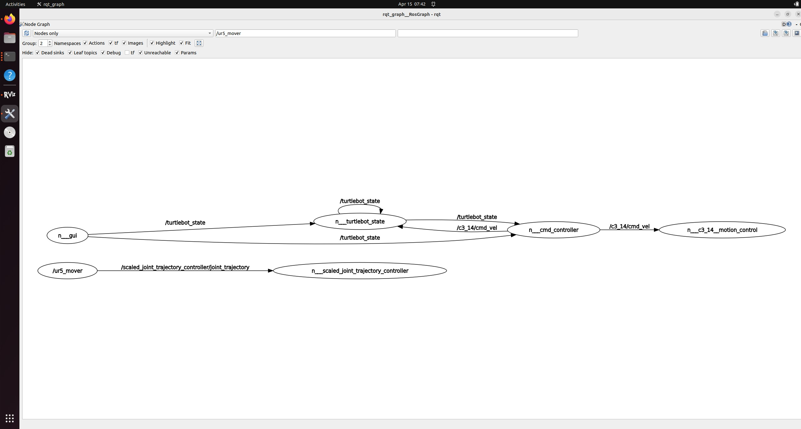

## I. Introduction
### Project name: Automatic Delivery Turtlebot Systems
#### i. Team number
* Team 12
#### ii. Team members 
* Sandy Lin
* Alan Cheng
* Yibo Yuan
#### iii. Academic Year
* 2025 Spring
#### iv. University
* Arizona State University
#### v. Class
* RAS598 Experimentation and Deployment of Robotic Systems
#### vi. Instructor
* Daniel M. Aukes

## II. Project
### i. Project description
#### Concept:
Our project combines a UR5 robotic arm with a Turtlebot to create an automated delivery robot systems. We will set up three cargo stations (A, B, C) and three different types of cargo (a, b, c). The UR5 robotic arm will transfer the colored blocks onto the Turtlebot, and after the Turtlebot reads the colors, it will deliver the block to the designated workstation.
#### The research question this project seeks to answer is: 
To present how can the integration of a UR5 robotic arm and a Turtlebot automate and optimize the process of sorting and delivering different types of goods to designated stations.

### ii. Sensor Integration
The LiDAR will be used to collect a 3D point cloud and convert it into a map. During testing, we ensure that the LiDAR accurately maps the environment and effectively avoids obstacles by comparing real-time data with the generated map. The IMU is evaluated to confirm that it precisely measures movement and maintains stability, which is vital for the robot's mobility. Additionally, the camera’s ability to recognize colors under various conditions will be tested. In the final demonstration, the LiDAR will be fully integrated to enable smooth navigation, ensuring that the Turtlebot moves efficiently towards workstations with the ability to avoid obstacles without collision. The IMU will be used to maintain the Turtlebot's balance and ensure stable movement during delivery tasks.

### iii. Interaction
#### RViz Interface:
We will use RViz to visualize robot states, sensor data, task progress, and debugging information in real-time.

### iv. Control and Autonomy
The processed sensor data enables real-time responses such as collision avoidance, stability adjustments, and immediate path corrections. For instance, the LiDAR data helps detect obstacles, while the IMU provides vital motion and balance information. At the higher level, the controller uses the refined sensor data to update path planning, ensuring the Turtlebot navigates efficiently and delivers blocks to the designated workstation based on color recognition.

### v. Preparation needs
To build the system, we need to understand how communication between UR5 and TurtleBot 4 works. Choosing the most suitable path-planning algorithm, such as Dijkstra, A*, or a more optimized alternative, is crucial for efficient TurtleBot 4 navigation and minimizing delivery time. Lastly, integrating useful Python packages like OpenCV for object detection will enhance the system's capabilities.

### vi. Final Demonstrartion
#### What resources will you need?
- The reference project on internet like similar projects in Github and any materials given by Prof. Aukes.
- UR5 robotic arm and turtlebot robot
- Sensor like IMU, LIDAR, encoders, etc.
- High-performance computer

#### Describe the classroom setup requirements. 
- UR5 robot arm
- A few small boxes
- Several boards make up the obstacle course. 
- Enough space for robotic operation

#### Conditions change in any environment. How will your robot handle variability in its environment?
We will test under serval different obstacle conditions to ensure that the robot are robust enough to handle variability.

#### Testing & Evaluation plan: Please describe how you can verify your system is working as expected?
We will conduct several tests to see if the robot works accurately. We will compare the sensor data and analog outputs to real-world conditions to ensure that our designed algorithms can accurately adapt to environmental changes.

### vii. Impact
This project will enhance our understanding of multi-robot communication by coordinating the UR5 robotic arm and TurtleBot 4. Building an Rviz simulation will help us simulate and test the system. Developing our own user interface will improve interaction and control. Lastly, exploring different path-planning algorithms will deepen our knowledge of autonomous navigation.

### viii. Advising
Dr. Aukes serves as our advisor for this project, providing technical guidance and hardware support. With his expertise in ROS2 development, robotic motion planning, and control systems, he plays a crucial role in helping us navigate the technical challenges of integrating the UR5 robotic arm and Turtlebot. Additionally, we plan to seek further technical guidance from other experts in the field to ensure the success of our project.

### iv. Project Progress & Future Tasks
#### Current Achievements:
1. UR5 Robotic Arm Control  
We successfully implemented control over the UR5 robotic arm, enabling it to perform pick-and-place tasks from point A to point B.

<iframe width="560" height="315"
        src="https://www.youtube.com/embed/wdnD8_uXcG0"
        title="UR5 Robotic Arm Demo" frameborder="0"
        allow="accelerometer; autoplay; clipboard-write; encrypted-media; gyroscope; picture-in-picture; web-share"
        allowfullscreen>
</iframe>

2. GUI Enhancement:
Added an "Origin" button based on the previously developed GUI. After initiating the system with the "Start" button, pressing "Origin" commands the Turtlebot to move to the designated position and wait to receive colored blocks.

#### GUI Interface

  

---

#### RQT Graph Visualization

  

3. Predefined Actions:
We successfully enabled the TurtleBot to execute predefined actions. When button A is pressed, it moves forward 3 meters and then turns left for 1 meter; when button B is pressed, it moves forward 3 meters and then turns right for 1 meter.

    <iframe width="560" height="315"
            src="https://www.youtube.com/embed/AvNOWas0qkQ"
            title="YouTube video demo" frameborder="0"
            allow="accelerometer; autoplay; clipboard-write; encrypted-media; gyroscope; picture-in-picture; web-share"
            allowfullscreen>
    </iframe>

4. Path Planning Algorithm Implementation:
Created an initial version of path planning within ttb_nav.py, incorporating obstacle detection and avoidance using ROS2's Nav2 framework.

5. Color Detection and Topic Publishing:
Integrated color detection logic in block_detector.py. Once the dominant color of a block is identified, it is published to the turtlebot_14/block_info topic. The Turtlebot subscribes to this topic to determine which workstation to navigate to based on the block color.

#### Upcoming Tasks:
1. Continuous Task Flow Logic:
Develop a controller that enables continuous round-trip operations between the UR5, the color detection positions, and the drop-off block position.

2. Path Planning Optimization:
Optimize the current path planning logic with more advanced algorithms such as A* or Dijkstra to enhance navigation efficiency and stability.

3. RViz Integration:
Add RViz visualization to support real-time monitoring and build a digital twin for the delivery system.

4. System Integration and Validation

